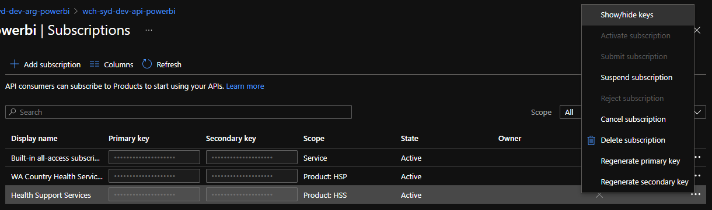

# Producer Deployment

## 1. Azure Pipelines

### 1.1. Pipeline Overview

Deployment is managed via the Azure Pipeline [pipeline.yml](Producer\pipelines\pipeline.yml) which performs the following jobs:

- **Infrastructure**: ARM template deployment of the Azure Infrastructure
- **Function Apps**: Build and deployment of the APIs hosted in Azure Functions
- **API Management**: ARM template deployment of the API Management instance and Power BI APIs

The deployment configuration is managed via the [variables.yml](pipelines/variables.yml)

To execute the pipeline, the `pipeline.yml` needs to be imported into Azure DevOps.

### 1.2. Prerequisites

Deployment into Azure is conducted via a Service Principal. The Service Connection needs to have `Contributor` RBAC access to the target Resource Group.

The pipeline communicates to Azure via a Service Connection. Details on configuring the Service Connection are within the article [Service connections (docs.microsoft.com)](https://docs.microsoft.com/en-us/azure/devops/pipelines/library/service-endpoints?view=azure-devops&tabs=yaml)

## 2. Service Principals

A Service Principal is used by the Function Apps to:
- Communicate with the Power BI REST API
- Retrieve Security Groups from Azure Active Directory

### 2.1. Creating the Service Principal

The script [create-app-registration.ps1](scripts/create-app-registration.ps1) creates the Service Principal / App Registration and stores the client secret in the Key Vault from [1. Pipeline Overview](#1-pipeline-overview).

### 2.2. Configuring Microsoft Graph permissions

- Update the App Registration to include Microsoft Graph - Read all groups. (Must have consent from Tenant Administrator) 

- Create an AAD Security Group and add the Service Principal as a member of the group. This group will be used in the next step

### 2.3. Configuring Power BI Permissions

- Navigate to the [Power BI Admin Portal](https://app.powerbi.com/admin-portal/tenantSettings)
- Navigate to Tenant settings / Developer settings
- For the AAD Security Group configured in step 2.2:
  - Configure "Allow service principals to suse Power BI APIs"

  - Configure "Allow service principals to use read-only Power BI admin APIs (Preview)


## 3. Using the API Management APIs

The following steps are completed within API Management, in the Azure portal.

### 3.1 Creating Subscriptions

Subscription define the credentials for an API consumer and are associated with Products (collection of APIs) they have access to.

The following points show creating a subscription for HSS and for a HSP. The HSP steps can be repeated for each HSP consuming the APIs.

- Create a Subscription for the Producer (HSS) API

- Create a Subscription for the Consumer (HSP) API


### 3.2 Creating the HSPs Power BI metadata

The HSPs metadata describes how the HSP will be represented when making calls to the Power BI service. It is created using the HSS subscription with a call to the API.

- Retrieve the HSS Primary Subscription Key

- Create a HSP's details in Cosmos DB, via the API Management endpoint
  
```
POST https://<<apim-instance-name>>.azure-api.net/powerbi-hss/Subscription
Ocp-Apim-Subscription-Key: {{subscriptionKey}}

{
    "id": "wachs",
    "adminSecurityGroup": "PBI_ADMIN_WACHS",
    "departmentName": "WA Country Health Services",
    "workspacePrefix": "WACHS"
}
```