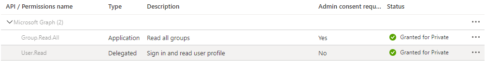

## Prerequisites
- AZ CLI
- AZ PowerShell Module
- DOTNET SDK
- VS Code

# Deployment

## Script Config

## ARM deployment

Creates the Azure Resource Group and dependant resources for the Producer capabilities. Requires 3 parameters
- **env**: Environment abbreviation. Valid values `[dev, tst, prd]`
- **clientPrefix**: Prefix used on all resources. Limit to 4 characters
- **aadObjectId**: The current user or AAD Security Group. Will be used to provide `[list, get]` permissions for Azure Key Vault
`.\deploy.ps1 -InfraDeploy -env "dev" -clientPrefix "wch" -aadObjectId "1234566892015"`
## KeyVault Config

Creates an App Registration in AAD and saves the underlying service principal ID and Secret to Azure Key Vault
`.\deploy.ps1 -KeyVaultConfig -env "dev" -clientPrefix "wch"`

### Post-Configuration

1. Update the App Registration to include **Microsoft Graph - Read all groups**. (Must have consent from Tenant Administrator)

2. Add the App Registration to the AAD Security Group that will be configured to use the Power BI Admin API
   - If a Security Group does not exist. Create now and add the App Registration
## Function App deployment
`.\deploy.ps1 -FuncDeploy -env "dev" -clientPrefix "wch"`
## APIM Deployment
`.\deploy.ps1 -ApimDeploy -env "dev" -clientPrefix "wch"`

## Post-deployment
- Generate the HSS Subscription
- Generate the HSP Subscription
- Call HSS /Subscription endpoint to create new HSP Subscription